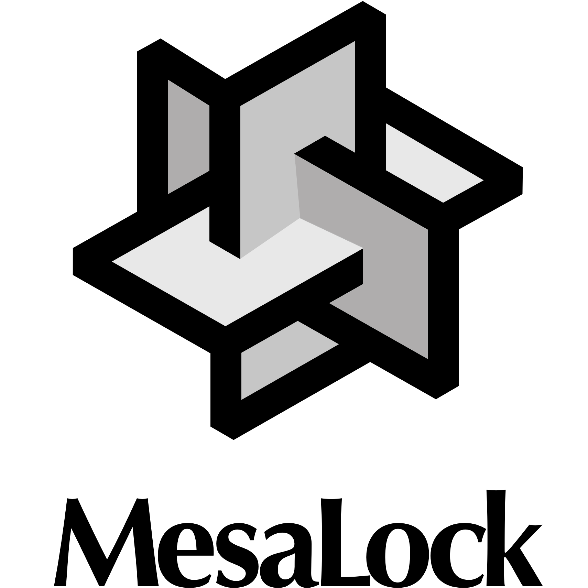
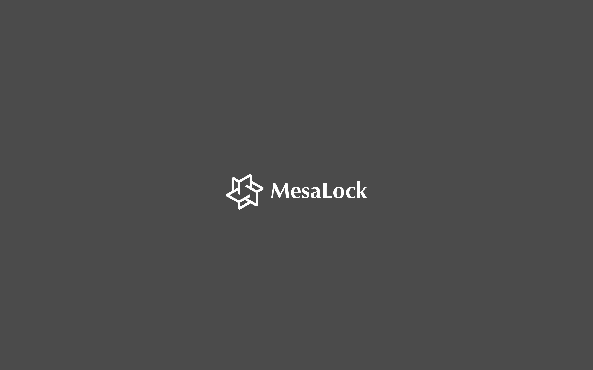
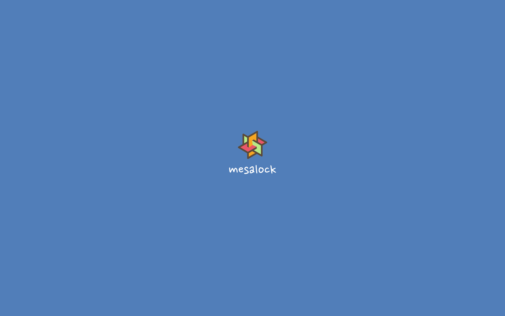

# Artwork

The idea of MesaLock logo was from Kongming lock, a traditional Chinese puzzle.

## MesaLock logo

| Rendering                                                                                                                             | Description                           | Download                                    |
| :-----------------------------------------------------------------------------------------------:                                     | ----------------------------          | ------------------------------------------- |
|                                       | MesaLock logo                         | [PNG](./img/mesalock_logo.png)              |
|  | MesaLock logo (horizontal)            | [PNG](./img/mesalock_logo_horizontal.png)   |
|                                | MesaLock signet                       | [PNG](./img/mesalock_signet.png)            |
|                 | MesaLock Wallpaper Grey (2880 x 1800) | [JPG](./img/mesalock_wallpaper_1.jpg)       |
|                 | MesaLock Wallpaper Blue (2880 x 1800) | [JPG](./img/mesalock_wallpaper_2.jpg)       |
